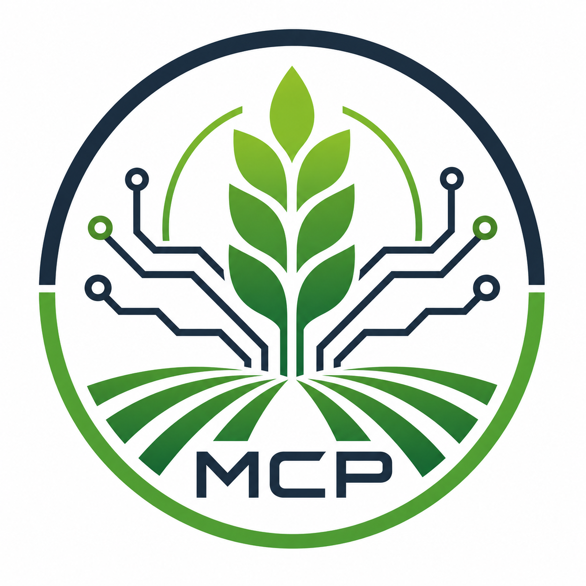

# Model Crop Protocol

**Model Crop Protocol** is an MCP service that connects agricultural data from the agrirouter ecosystem with AI agents and automated workflows.

The service provides a structured interface for accessing machine data, task information, operational events, and other agricultural context through the **Model Context Protocol (MCP)**. It acts as a bridge between field-level data exchange and agent-based processing, making agrirouter information available in a controlled, consistent, and tool-friendly way.

## Purpose

Model Crop Protocol is designed to make agricultural data usable for modern AI-driven applications. Instead of exposing raw or fragmented data directly, the service translates relevant information into well-defined MCP tools, resources, and contextual data structures.

This enables AI agents to:

- retrieve agricultural and machine-related information,
- analyze operational context,
- support decision-making workflows,
- integrate agrirouter data into broader automation scenarios,
- and interact with field data in a secure and structured way.